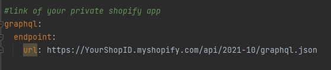
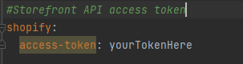

## Shopify Client Spring

I needed to make shopify client in spring for my private project and couldnt find any examples on the internet ,
struggled a lot and finally made one . Sharing it because there might be some other people looking for one like I used
to . This project uses https://github.com/graphql-java-generator
to generate boilerplate code just from .graphqls file.Got my .graphqls by exporting SDL from Altair . Had to define some
custom scalars in pom as well .

### How to use it?

- First go to application.yml and change the url to your shopify app
    - How to create shopify app https://help.shopify.com/en/manual/apps/private-apps
- Next put your StoreFront API access token once again in the application.yml file
- After that use Maven clean compile and you are good to go
- Of course you would need to have made shopify private app with products on it for main application to work
- Use this to figure out how to write proper queries https://github.com/Shopify/storefront-api-learning-kit